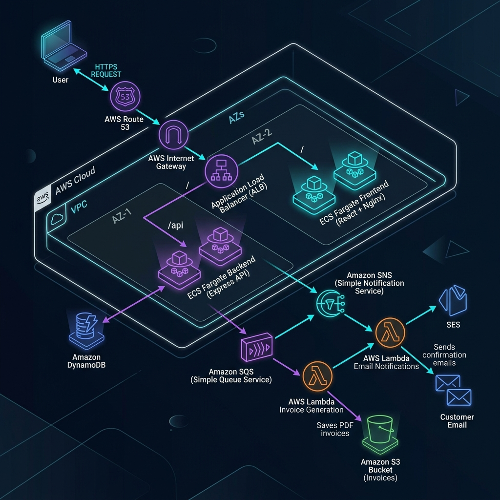

# Hybrid DevOps E-Commerce AWS Platform

A production-ready, cloud-native E-Commerce system utilizing containerized applications on AWS ECS Fargate, event-driven serverless processes via AWS SAM, and Infrastructure as Code with Terraform.

## 🏗️ Architecture Design



For detailed structural specifications, see the [Architecture Documentation](docs/architecture.md) and [Mermaid Configuration Diagram](docs/mermaid/architecture.mermaid).

---

## 📂 Project Repository Layout

```
sam-iac-project/
├── .github/workflows/          # GitHub Actions CI/CD pipelines
│   ├── frontend-ci-cd.yml      # ECS Frontend container build, push, deploy
│   ├── backend-ci-cd.yml       # ECS Backend unit test, scan, deploy
│   ├── sam-ci-cd.yml           # SAM Serverless cloud resource builder
│   └── infra-ci-cd.yml         # Terraform format, plan, apply check
├── apps/
│   ├── frontend/               # React + Vite web client SPA
│   └── backend/                # Express REST API (Auth, Catalog, Orders)
├── deployments/ecs/            # ECS deployment templates & config mappings
│   ├── frontend/               # Frontend Task Def, Nginx config, Dockerfile
│   └── backend/                # Backend Task Def, Dockerfile, Service Config
├── infrastructure/terraform/   # IaC files (Network, ALB, ECR, ECS modules)
│   ├── environments/           # Environment config (prod)
│   └── modules/                # Reusable resource modules
├── serverless/sam/             # AWS SAM application (SNS, SQS, S3, Lambdas)
│   └── src/                    # Node.js Lambda function handlers
└── scripts/                    # Convenience utility & deployment shell scripts
```

---

## 🚀 Getting Started Locally

### Prerequisites
* [Docker Desktop](https://www.docker.com/products/docker-desktop/)
* [Node.js v18+](https://nodejs.org/)
* [Git-Bash](https://gitforwindows.org/) (for Windows environments to run shell scripts)

### Run the System in Local Sandbox Mode
To quickly spin up the frontend and backend containers locally with mocked integrations (bypassing AWS services):

1. **Launch Containers**:
   ```bash
   ./scripts/local-start.sh
   ```
2. **Access Interfaces**:
   * **Frontend Application**: [http://localhost:8080](http://localhost:8080)
   * **Backend Health Check**: [http://localhost:3000/api/health](http://localhost:3000/api/health)
3. **Stop & Clean Up**:
   ```bash
   ./scripts/local-stop.sh
   ```

---

## 🛠️ Deploying to AWS

For manual deployments and builds, follow the step-by-step setup guides:

1. **Infrastructure Provisioning**: Read the [Terraform IaC Guide](infrastructure/terraform/README.md).
2. **Serverless Architecture**: Read the [AWS SAM Guide](serverless/sam/README.md).
3. **Deployment Helper Scripts**:
   * `./scripts/ecr-login.sh <ACCOUNT_ID> [REGION]`: Authenticate local docker.
   * `./scripts/deploy-frontend.sh <REGION> <ECR_URL> <CLUSTER> <SERVICE>`: Compile, tag, push and deploy frontend container.
   * `./scripts/deploy-backend.sh <REGION> <ECR_URL> <CLUSTER> <SERVICE>`: Test, tag, push and deploy backend container.
   * `./scripts/deploy-sam.sh [ENV]`: Compile and update Lambda CloudFormation resources.
   * `./scripts/force-new-ecs-deployment.sh <CLUSTER> <SERVICE> [REGION]`: Restarts active containers without updating task templates.

---

## 🔒 CI/CD Pipeline Automation

Workflows are managed via GitHub Actions:
* **`Frontend CI/CD`**: Triggers on `apps/frontend/` updates. Bundles assets, builds/pushes the Docker image, and triggers an ECS rolling deploy.
* **`Backend CI/CD`**: Triggers on `apps/backend/` updates. Executes Jest test suites, scans for Docker image vulnerabilities using **Trivy**, pushes to ECR, and triggers an ECS rolling deploy.
* **`SAM Serverless CI/CD`**: Triggers on `serverless/sam/` changes. Compiles node packages, runs `sam build`, and deploys CloudFormation templates.
* **`Terraform Infrastructure CI/CD`**: Triggers on `infrastructure/terraform/` changes. Verifies formatting (`terraform fmt`), plans updates, and applies changes.

*Required GitHub repository secrets:*
* `AWS_ACCESS_KEY_ID`: IAM user deployment access token.
* `AWS_SECRET_ACCESS_KEY`: IAM user secret token.
